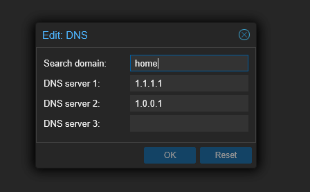

# home-server

Setting up Proxmox and deploying [things](./dietpi-base-vm/) to it.

## DNS
To resolve custom names within local, point router's DNS to Proxmox's IP. But **before** that, do this in Proxmox:
- Make sure to use dnsmasq as the DNS resolver
- Create a file `home.net.conf` inside `/etc/dnsmasq.d`. Each IP are the k3s agents. 
```
search home
nameserver 1.1.1.1
nameserver 1.0.0.1
root@bethany:/etc/dnsmasq.d# cat home.net.conf
# Resolve stats.home.net to multiple IPs
address=/stats.home.net/192.168.1.220
address=/stats.home.net/192.168.1.221
address=/stats.home.net/192.168.1.222

# Resolve argo.home.net to multiple IPs
address=/argo.home.net/192.168.1.220
address=/argo.home.net/192.168.1.221
address=/argo.home.net/192.168.1.222

# Resolve home.net to multiple IPs
address=/home.net/192.168.1.220
address=/home.net/192.168.1.221
address=/home.net/192.168.1.222
```
- In the Proxmox UI -> bethany -> System -> DNS change DNS to `1.1.1.1` and `1.0.0.1`


## Storage 
Create a RAID-Z1 ZFS pool `zpool create media-tank raidz /dev/disk/by-id/ata-ST8000VN004-3CP101_WWZ2G9X7 /dev/disk/by-id/ata-ST8000VN004-3CP101_WWZ2GBC8 /dev/disk/by-id/ata-ST8000VN004-3CP101_WWZ4061G`

Creates a mount point at `/media-tank`

### Add new disks 
`zpool add media-tank raidz /dev/disk/by-id/ata-ST8000VN004-3CP101_WP01JPTQ /dev/disk/by-id/ata-ST8000VN004-3CP101_WWZ64L5F /dev/disk/by-id/ata-ST8000VN004-3CP101_WWZ669S4`

- Don't format the disks before hand!

## SSH CloudFlared
Created a tunnel using `cloudflared`, https://developers.cloudflare.com/cloudflare-one/connections/connect-networks/use-cases/ssh/#connect-to-ssh-server-with-cloudflared-access
- Install on the target (e.g. Proxmox)
- Install on the client
- `nano ~/.ssh/config` on the client:
```
Host sshpm.munyard.dev
ProxyCommand /usr/local/bin/cloudflared access ssh --hostname %h
```
## SSH Tailscale
Tailscale creates a private virtual network (backed by WireGuard) that gives connected devices an IP address they can reach each other by. 

- Install Tailscale to give the device an internet accessible IP address that is routed via the Tailscale VPN https://tailscale.com/kb/1031/install-linux
